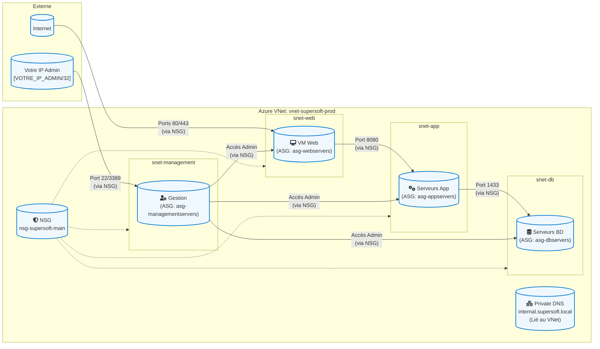
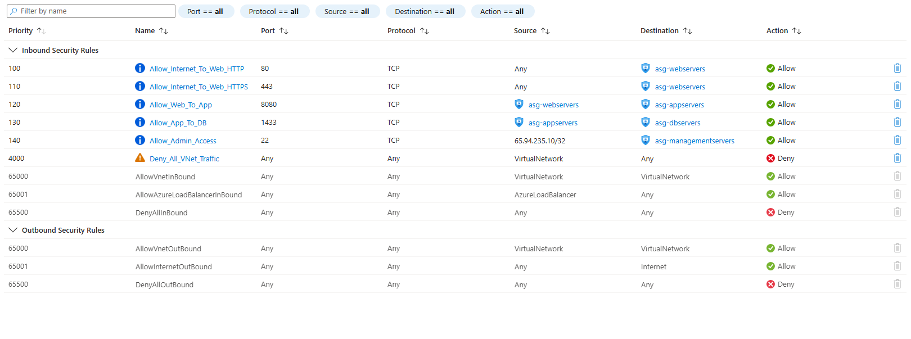
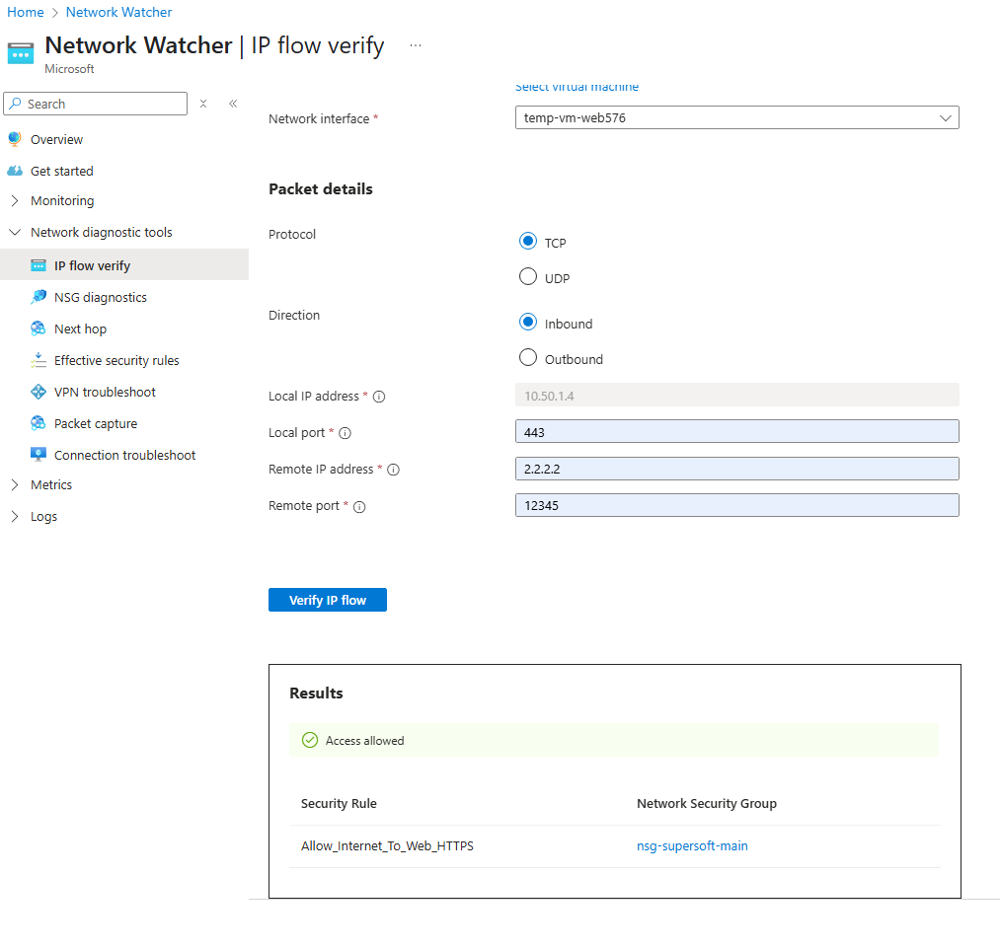
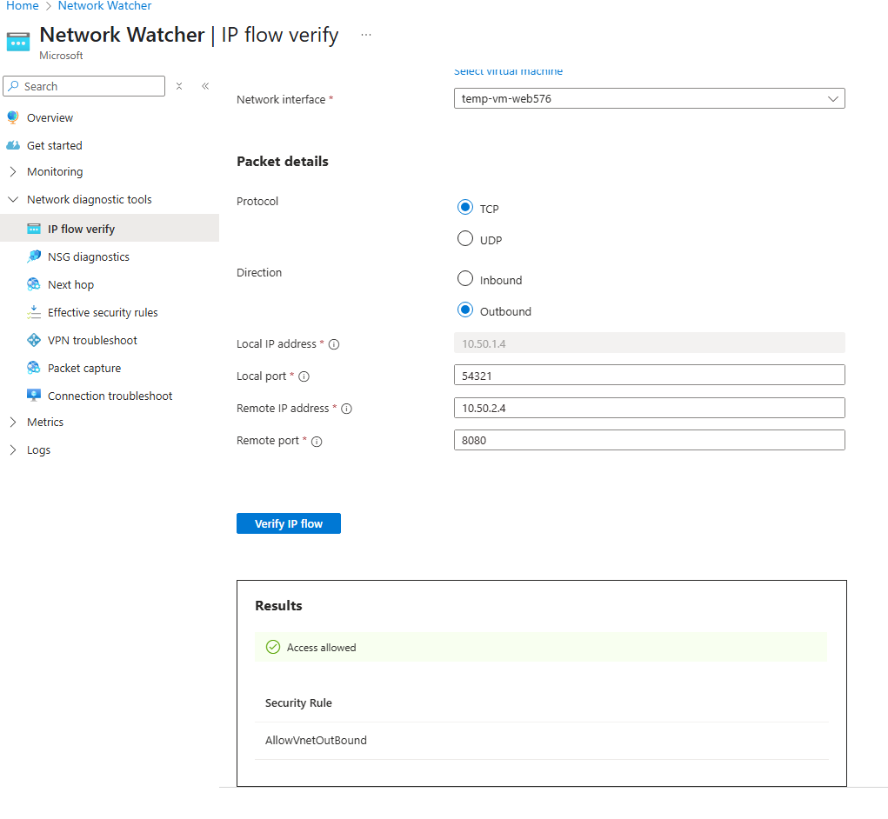
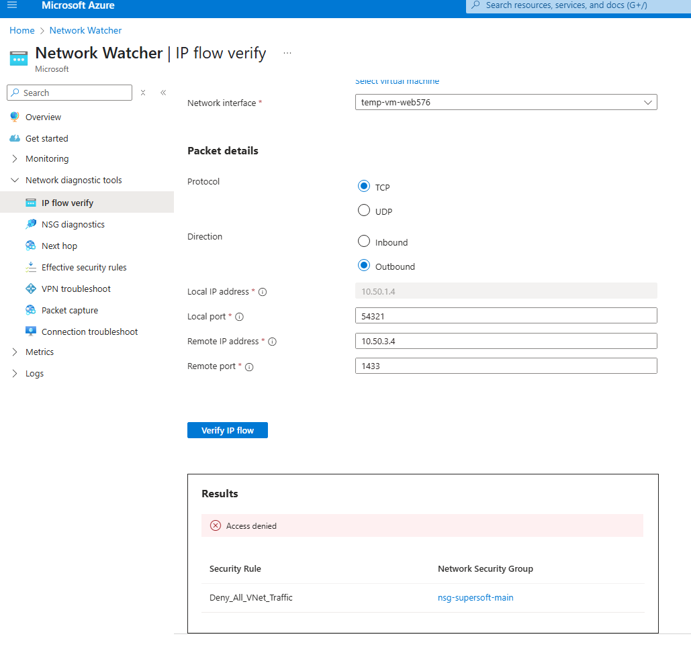
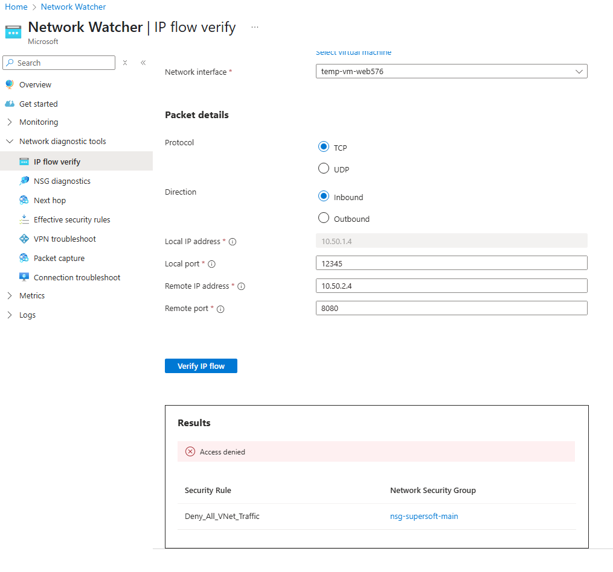

# Projet : Infrastructure Réseau Azure Sécurisée à 3 Niveaux via ARM Template (AZ-104)

Ce projet déploie une infrastructure réseau sécurisée et segmentée dans Microsoft Azure à l'aide d'un **template ARM** (Azure Resource Manager). L'infrastructure est conçue pour héberger une application web à 3 niveaux et couvre les concepts clés de l'examen AZ-104.

## 🗺️ Architecture de la Solution

L'infrastructure déployée par le template ARM comprend les éléments suivants :
*   Un réseau virtuel (VNet) segmenté en sous-réseaux pour les niveaux Web, Application, Base de données et Gestion.
*   Une Groupe de Sécurité Réseau (NSG) avec des règles prédéfinies pour contrôler le flux de trafic.
*   Des Groupes de Sécurité d'Application (ASG) pour faciliter la gestion des règles NSG.
*   Une Zone DNS Privée Azure (Private DNS Zone) pour la résolution de noms interne.
*   Une machine virtuelle temporaire pour les tests.

## Schéma d'architecture global :




## 🚀 Déploiement via ARM Template

### Prérequis
*   Azure CLI ou Azure PowerShell installés.
*   Un compte Azure avec une souscription active.
*   Permissions nécessaires pour créer des ressources dans la souscription.

### Fichiers du Template
*   `template.json`: Template ARM principal.
*   `parameters.json`: Fichier de paramètres (recommandé).
    *(Adaptez les noms de fichiers à ceux que vous utilisez)*

### Étapes de Déploiement
 1.  Clonez ce dépôt : git clone https://github.com/anopochkin/azure-secure-3tier-network-az104.git
 2.  **Modifiez le fichier `parameters.json`** pour ajuster les paramètres à votre environnement. **Il est essentiel de fournir une valeur sécurisée pour le paramètre `adminPassword`.** Vous pouvez également ajuster les noms des ressources, la localisation (si paramétrée), etc.
 3.  Déployez le template en utilisant Azure CLI :
     ```bash
     az deployment group create \
       --resource-group [NomDeVotreGroupeDeRessources] \
       --template-file template.json \
       --parameters parameters.json 
     ```
     Ou en utilisant Azure PowerShell :
     ```powershell
     New-AzResourceGroupDeployment `
       -ResourceGroupName [NomDeVotreGroupeDeRessources] `
       -TemplateFile .\template.json `
       -TemplateParameterFile .\parameters.json 

## 🛡️ Logique de Sécurité (Règles NSG)

Le template ARM configure un Groupe de Sécurité Réseau `nsg-supersoft-main` avec les règles suivantes pour segmenter le trafic. Ce NSG est associé aux sous-réseaux `snet-web, snet-app, snet-db, snet-management`.

*   **Accès Web (Entrant) :**
    *   Ports `80 (HTTP)` et `443 (HTTPS)` autorisés depuis `Internet` vers l'ASG `asg-webservers`.
*   **Communication Web vers Application (Interne) :**
    *   Port `Port 8080 TCP` autorisé depuis l'ASG `snet-web` vers l'ASG `snet-app`.
*   **Communication Application vers Base de Données (Interne) :**
    *   Port `Port BD 1433 TCP` autorisé depuis l'ASG `snet-app` vers l'ASG `snet-db`.
*   **Accès Administratif (Entrant) :**
    *   Port `Port RDP/SSH 22 ou 3389 TCP` autorisé depuis une adresse IP source spécifique (paramétrable ou `[Votre IP Publique]/32`) vers le sous-réseau `snet-management`.
*   **Refus du trafic intra-VNet par défaut :**
    *   Une règle avec une priorité plus basse (`4000`) refuse tout autre trafic entre les sous-réseaux du `VirtualNetwork` pour appliquer le principe du moindre privilège.

*(Tableau des règles de sécurité NSG configurées par le template) :*



## 🛠️ Vérification et Tests (Azure Network Watcher)

Après le déploiement et la configuration manuelle, les tests suivants ont été effectués à l'aide d'Azure Network Watcher.

### Vérification du flux IP (IP Flow Verify)

Plusieurs tests de flux IP ont été effectués à l'aide d'Azure Network Watcher pour valider les règles NSG. Les détails complets de chaque test (paramètres, source, destination, ports, protocole et résultat) sont visibles dans les captures d'écran ci-dessous. La machine virtuelle temporaire `temp-vm-web` (associée à l'ASG `asg-webservers`) a servi de point de référence.

*   **Test 1 : Accès Internet entrant vers la VM Web sur HTTPS (Port 443)**
    *   Voir les détails et le résultat : 
        
*   **Test 2 : Communication sortante de la VM Web vers le niveau Application (Port Applicatif `[ex: 8080]`)**
    *   Voir les détails et le résultat : 

*   **Test 3 : Tentative de communication sortante de la VM Web vers le niveau Base de Données (Port BD `[ex: 1433]`)**
    *   Voir les détails et le résultat : 

*   **Test 4 : Tentative d'accès Internet entrant vers le niveau Application (Port Applicatif `[ex: 8080]`)**
    *   Voir les détails et le résultat : 

---

## 🏁 Conclusions et Compétences Démontrées

Ce projet illustre la capacité à définir et déployer une infrastructure réseau Azure sécurisée en utilisant Infrastructure as Code (IaC) via des templates ARM. Il met également en évidence les étapes de configuration manuelle complémentaires et les processus de validation.

Compétences clés démontrées :
*   Création et gestion de templates ARM pour l'infrastructure réseau.
*   Déploiement et configuration des VNets, sous-réseaux, NSG, ASG via ARM.
*   Compréhension de la segmentation réseau et des flux de trafic dans une architecture à 3 niveaux.
*   Configuration des Zones DNS Privées Azure.
*   Utilisation d'Azure Network Watcher pour le diagnostic et la validation.

---

## 🧹 Nettoyage des Ressources
Pour supprimer toutes les ressources déployées par ce template, supprimez le groupe de ressources.

---

## 👨‍💻 Auteur

- Projet personnel pour la préparation à l'examen AZ-104.
- * Profil LinkedIn : https://www.linkedin.com/in/anopochkin/
