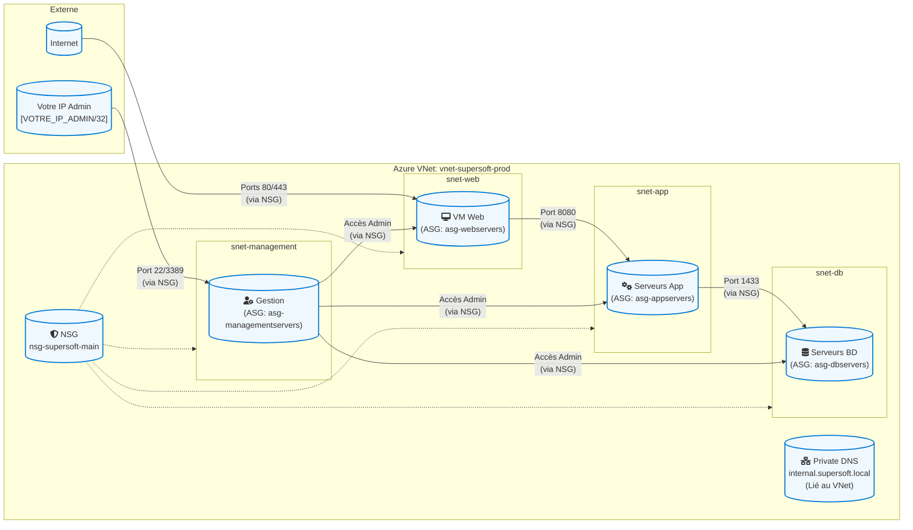

# Projet : Infrastructure Réseau Azure Sécurisée à 3 Niveaux via ARM Template (AZ-104)

Ce projet déploie une infrastructure réseau sécurisée et segmentée dans Microsoft Azure à l'aide d'un **template ARM** (Azure Resource Manager). L'infrastructure est conçue pour héberger une application web à 3 niveaux et couvre les concepts clés de l'examen AZ-104.

## 🗺️ Architecture de la Solution

L'infrastructure déployée par le template ARM comprend les éléments suivants :
*   Un réseau virtuel (VNet) segmenté en sous-réseaux pour les niveaux Web, Application, Base de données et Gestion.
*   Une Groupe de Sécurité Réseau (NSG) avec des règles prédéfinies pour contrôler le flux de trafic.
*   Des Groupes de Sécurité d'Application (ASG) pour faciliter la gestion des règles NSG.
*   Une Zone DNS Privée Azure (Private DNS Zone) pour la résolution de noms interne (configuration manuelle des enregistrements A après déploiement).
*   Une machine virtuelle temporaire pour les tests.

## Schéma d'architecture global :




## 🚀 Déploiement via ARM Template

### Prérequis
*   Azure CLI ou Azure PowerShell installés.
*   Un compte Azure avec une souscription active.
*   Permissions nécessaires pour créer des ressources dans la souscription.

### Fichiers du Template
*   `main.arm.json` (ou `azuredeploy.json`): Template ARM principal.
*   `parameters.arm.json` (ou `azuredeploy.parameters.json`): Fichier de paramètres (recommandé).
    *(Adaptez les noms de fichiers à ceux que vous utilisez)*

### Étapes de Déploiement
 1.  Clonez ce dépôt : `git clone [URL de votre dépôt]`
 2.  Naviguez vers le dossier contenant les fichiers du template.
 3.  **Copiez `parameters.example.json` vers un nouveau fichier nommé `parameters.json`.**
 4.  **Modifiez le fichier `parameters.json`** pour ajuster les paramètres à votre environnement. **Il est essentiel de fournir une valeur sécurisée pour le paramètre `adminPassword`.** Vous pouvez également ajuster les noms des ressources, la localisation (si paramétrée), etc.
 5.  (Optionnel) Créez un groupe de ressources Azure si vous n'en avez pas déjà un : `az group create --name [NomDeVotreGroupeDeRessources] --location [VotreRegion]`
 6.  Déployez le template en utilisant Azure CLI :
     ```bash
     az deployment group create \
       --resource-group [NomDeVotreGroupeDeRessources] \
       --template-file template.json \
       --parameters parameters.json 
     ```
     Ou en utilisant Azure PowerShell :
     ```powershell
     New-AzResourceGroupDeployment `
       -ResourceGroupName [NomDeVotreGroupeDeRessources] `
       -TemplateFile .\template.json `
       -TemplateParameterFile .\parameters.json 

    ```
    *(Assurez-vous que `[NomDeVotreGroupeDeRessources]` est créé au préalable ou que le template le crée).*

## ⚙️ Configuration Manuelle Post-Déploiement

Certaines configurations peuvent nécessiter des étapes manuelles après le déploiement du template ARM :

1.  **Enregistrements DNS dans la Private DNS Zone :**
    *   Le template ARM crée la zone `[Nom de votre zone DNS, ex: internal.supersoft.local]` et la lie au VNet.
    *   Les enregistrements A pour les serveurs (ex: `web01`, `app01`, `db01`) doivent être ajoutés manuellement via le portail Azure ou par script.
        *   *(Insérez ici un скриншот ваших A-записей после их ручного добавления)*
            ``
2.  **Association des ASG aux interfaces réseau des VMs :**
    *   Si votre template ARM déploie des VMs (même temporaires), assurez-vous que les ASG appropriés (`asg-webservers`, `asg-appservers`, etc.) sont associés à leurs interfaces réseau. Cela peut être fait via le portail ou par un script post-déploiement.
    *   *(Si vous avez une VM de test déployée par ARM, insérez un скриншот de l'association ASG à sa NIC)*
        ``
3.  *(Autres étapes manuelles, si nécessaire)*

## 🛡️ Logique de Sécurité (Règles NSG)

Le template ARM configure un Groupe de Sécurité Réseau (`[Nom de votre NSG, ex: nsg-supersoft-main]`) avec les règles suivantes pour segmenter le trafic. Ce NSG est associé aux sous-réseaux `[ex: snet-web, snet-app, snet-db, snet-management]`.

*   **Accès Web (Entrant) :**
    *   Ports `80 (HTTP)` et `443 (HTTPS)` autorisés depuis `Internet` vers l'ASG `[Nom ASG Web, ex: asg-webservers]`.
*   **Communication Web vers Application (Interne) :**
    *   Port `[Port applicatif, ex: 8080 TCP]` autorisé depuis l'ASG `[Nom ASG Web]` vers l'ASG `[Nom ASG App]`.
*   **Communication Application vers Base de Données (Interne) :**
    *   Port `[Port BD, ex: 1433 TCP]` autorisé depuis l'ASG `[Nom ASG App]` vers l'ASG `[Nom ASG DB]`.
*   **Accès Administratif (Entrant) :**
    *   Port `[Port RDP/SSH, ex: 22 ou 3389 TCP]` autorisé depuis une adresse IP source spécifique (paramétrable ou `[Votre IP Publique]/32`) vers le sous-réseau `[Nom sous-réseau Management]`.
*   **Refus du trafic intra-VNet par défaut :**
    *   Une règle avec une priorité plus basse (`[ex: 4000]`) refuse tout autre trafic entre les sous-réseaux du `VirtualNetwork` pour appliquer le principe du moindre privilège.

*(Tableau des règles de sécurité NSG configurées par le template) :*

*(Capture d'écran **essentielle** de vos règles NSG telles que définies dans le template ou après déploiement, nommez-la `nsg-rules-template.png` et téléversez-la dans `images`)*

## 🛠️ Vérification et Tests (Azure Network Watcher)

Après le déploiement et la configuration manuelle, les tests suivants ont été effectués à l'aide d'Azure Network Watcher. * (Si votre template ne déploie pas de VM de test, vous devrez en créer une manuellement pour ces tests et le mentionner).*

### Vérification du flux IP (IP Flow Verify)
*(Décrivez les tests et résultats comme dans le template précédent, en indiquant les IP et ASG)*
    *   **Test 1 : Internet -> VM Web (HTTPS)**
        *   Résultat Obtenu : `[Indiquez le résultat obtenu]`.
        *   ``
    *   *(...autres tests IP Flow Verify со скриншотами...)*

### Dépannage de la connexion (Connection Troubleshoot - pour DNS)
*(Опишите проблему с DNSResolution, как мы обсуждали)*
    *   ``

### Tronçon suivant (Next Hop)
*(Décrivez les tests et результаты как в предыдущем шаблоне)*
    *   ``
    *   *(...другие тесты Next Hop...)*

### Topologie (Topology)
*(Если использовали)*
``

### Règles de sécurité effectives (Effective Security Rules)
*(Если использовали)*
``

---

## 🏁 Conclusions et Compétences Démontrées

Ce projet illustre la capacité à définir et déployer une infrastructure réseau Azure sécurisée en utilisant Infrastructure as Code (IaC) via des templates ARM. Il met également en évidence les étapes de configuration manuelle complémentaires et les processus de validation.

Compétences clés démontrées :
*   Création et gestion de templates ARM pour l'infrastructure réseau.
*   Déploiement et configuration des VNets, sous-réseaux, NSG, ASG via ARM.
*   Compréhension de la segmentation réseau et des flux de trafic dans une architecture à 3 niveaux.
*   Configuration des Zones DNS Privées Azure.
*   Utilisation d'Azure Network Watcher pour le diagnostic et la validation.
*   *(Ajoutez d'autres compétences si pertinent, ex: paramétrage des templates ARM)*

---

## 🧹 Nettoyage des Ressources
Pour supprimer toutes les ressources déployées par ce template, supprimez le groupe de ressources `[NomDeVotreGroupeDeRessources]`.

---

## 👨‍💻 Auteur

- **Nom :** `[Votre Nom]`
- Projet personnel pour la préparation à l'examen AZ-104.
- *(Optionnel) Profil LinkedIn : [Votre lien LinkedIn]*
